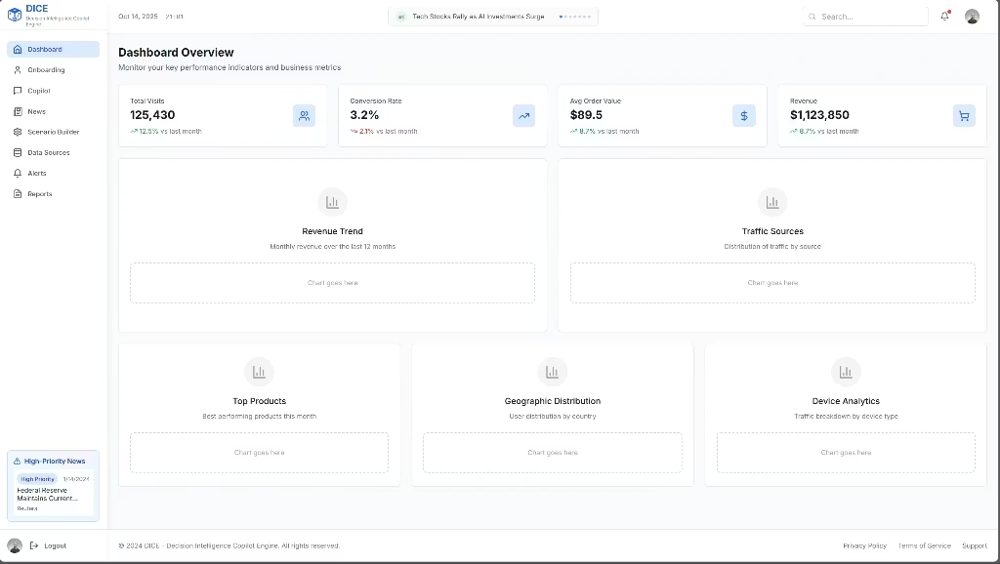

<p align="center">
  
  
  
</p>

<div align="center">
  
  <h1 style="margin: 0;">DICE (Decision Intelligence Copilot)</h1>
</div>

> ✨ Transform your marketing data into **actionable decisions** in seconds! ✨

---

## ✨ Key Features

- 💬 **Chat-Based Decision Copilot**  
  Ask natural-language questions on sales & ad data; receive data-backed insights, confidence scores & ready-to-run playbooks.

- 🔮 **Scenario Simulation Engine**  
  Run “what-if” experiments (budgets, discounts, channels) and forecast KPI impacts (Sales, CAC, LTV, Margin).

- 📊 **KPI Dashboard & Alerts**  
  Daily/weekly metrics (Sales, CAC, ROAS, Top Products) plus real-time anomaly alerts & root-cause recommendations.

- 🔌 **Seamless Data Connectors**  
  GA4, Google Ads, Meta Ads, CSV uploads (sales) & local Iranian e-commerce platforms—live insights in under an hour.

- 📥 **Exportable Reports**  
  Generate polished PDF or Markdown summaries including actionable playbooks for your team or clients.

---

## ⚙️ High-Level Architecture

```
Frontend (React/TS)
    ↓ 
Backend (Django + DRF)
    ↓ 
ETL & Tasks (Python + Celery)
    ↓ 
Storage 
  • PostgreSQL (metrics)
  • S3-compatible (raw files)
    ↓ 
Vector DB (Milvus embeddings)
    ↓ 
RAG → LLM → UI

---

## 🚀 Quick Start

> **Prerequisites:** Docker, Docker Compose, Python 3.9+, Node 14+

1. **Clone the repo**  
   ```bash
   git clone https://github.com/your-org/dice.git
   cd dice
   ```
2. **Configure environment**  
   ```bash
   cp .env.example .env
   # Fill in DB, S3, API keys…
   ```
3. **Launch all services**  
   ```bash
   docker-compose up --build
   ```
4. **Open the App**  
   Navigate to <http://localhost:3000> and follow the onboarding wizard.

---

## 📸 Gallery

<p align="center">
  
</p>

---

## 🛠️ Next Steps & Contributing

- Dive deeper into [docs/](docs/) for API details & architecture guides.  
- To contribute, read [docs/CONTRIBUTING.md](docs/CONTRIBUTING.md) and join our community.

---

## 📄 License

Distributed under the **MIT License**. See [LICENSE](LICENSE) for details.

